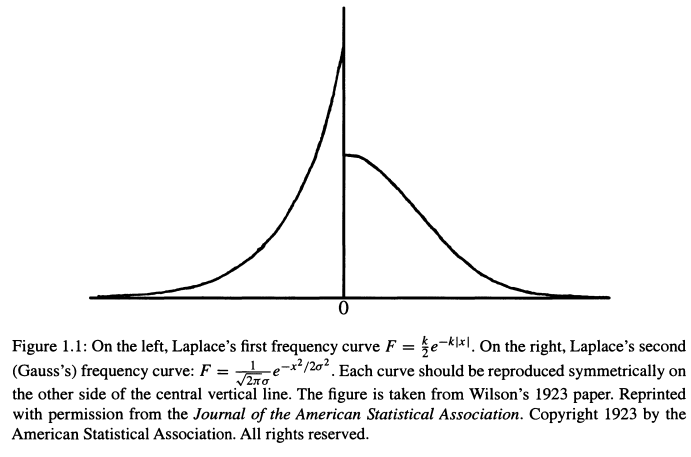
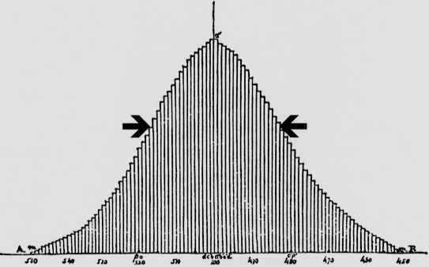
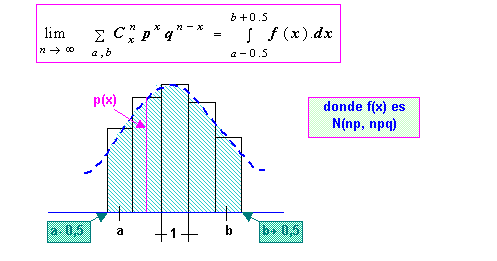
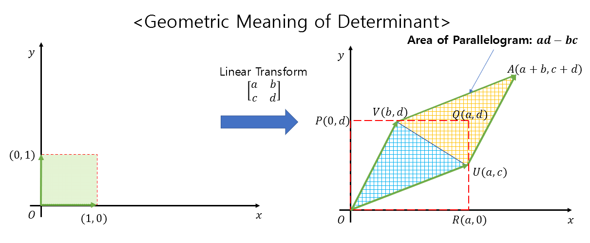
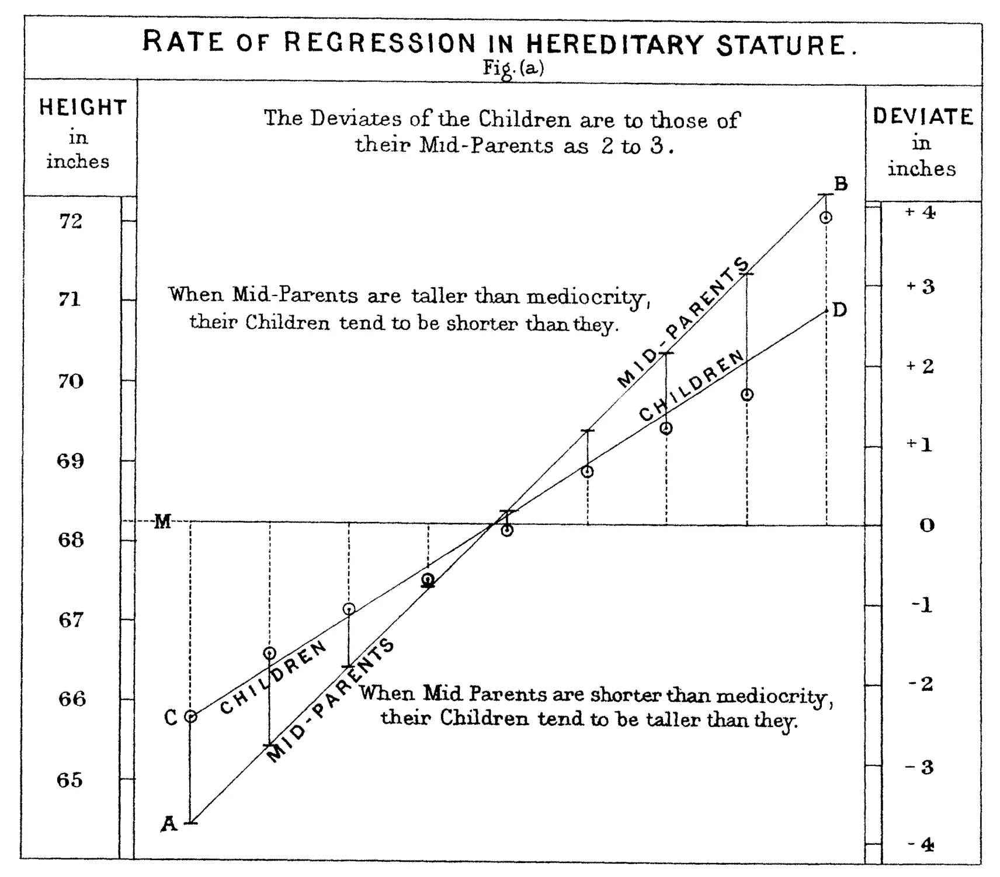

```{r}
library(appraiseR)
```


# Probabilidade

## Definição clássica de probabilidade

- Definição clássica de Laplace:
  - É a razão entre a chance ($f$) que um evento ($A$) ocorra e a soma das 
  chances de todos os eventos possíveis ($N$):
    - $$\mathbb P(A) = \frac{f}{N}$$
  
- Exemplo:
  - Ao lançar um dado, a probabilidade de obtenção de um número dentro do 
  conjunto $\{ 1, 2 ,3, 4, 5, 6\}$  é:
    - $$\mathbb P(A) = \frac{1}{6}$$
    
- Problema: define probabilidade como a "chance" que o evento ocorra.
  - A cobra come o rabo!
  
## Escola axiomática

- @kolmogorov1950:
  - Definiu axiomas a partir dos quais é possível desenvolver a Probabilidade 
  como uma ciência rigorosa.
    - Espaço Amostral ($S$)
    - $\mathbb P(S) = 1$
    - Se dois eventos $A$ e $B$ são mutuamente exclusivos, então:
      - $\mathbb P(A + B) = \mathbb P(A) + \mathbb P(B)$
      
- Na escola axiomática, os eventos são subconjuntos do espaço amostral  
  - Assim, é comum se referir aos eventos através da teoria dos conjuntos:
    - $\mathbb P (A \cup B) =  \mathbb P(A) + \mathbb P(B)$
    - $\mathbb P (A \cup B) =  \mathbb P(A) + \mathbb P(B) - \mathbb P (A \cap B)$
    
## Escola Axiomática

```{r}
set.seed(654925)                          # Create example list
list_venn <- list(Alto = sort(sample(1:100, 20)),
                  Baixo = sort(sample(1:100, 20)),
                  Centro = sort(sample(1:100, 20)),
                  Suburbio = sort(sample(1:100, 20)))
library(ggvenn) 
ggvenn(list_venn[c("Alto", "Centro")], c("Alto", "Centro"))  
```

    
## Probabilidade Complementar

- $$\mathbb P(A') = 1 - \mathbb P(A)$$
  - Por exemplo, se a probabilidade de um imóvel ser de Alto Padrão é de 25%
    - Então a probabilidade de um imóvel não ser de Alto Padrão é de 75%!
    
## Probabilidade Condicional

- A Probabilidade Condicional de um evento é a probabilidade que um evento
ocorra, dado que outro evento aconteceu
  - É designada por $\mathbb P(A|B)$
  - É definida como o quociente entre $\mathbb P(A \cap B)$ e $\mathbb P(B)$:
    - $$\mathbb P(A|B) = \frac{\mathbb P(A \cap B)}{\mathbb P(B)}\, \text{se }\mathbb P(B) > 0$${#eq-PCond}
    
## Probabilidade Condicional
    
- Exemplo:
  - Há 2.000 imóveis numa cidade
    - 100 deles encontram-se no Centro
      - $\mathbb P(C) = 100/2.000 = 0,05$
    - 200 deles são de alto padrão 
      - $\mathbb P(PC_A) = 200/2.000 = 0,10$
      - Destes 200, 80 encontram-se localizados no Centro 
        - $\mathbb P(PC_A \cup C) = 80/2.000 = 0,04$
  - Dado que um imóvel situa-se no Centro
    - Qual a probabilidade de que ele seja de alto padrão?
      - $$\mathbb P(PC_A|C) = \frac{\mathbb P(PC_A \cap C)}{P_C}$$
      
## Probabilidade Condicional

- Dado que um imóvel situa-se no Centro
  - Qual a probabilidade de que ele seja de alto padrão?
    - $$\mathbb P(PC_A|C) = \frac{\mathbb P(PC_A \cap C)}{P_C}$$
    - $$\mathbb P(PC_A|C) = \frac{0,04}{0,05} = 80\%$$
    
## Probabilidade Condicional

```{r}
df <- data.frame(id = 1:2000,
                 Padrao = c(rep("Alto", 200), rep("Não-Alto", 1800)),
                 Local = c(rep("Centro", 90), rep("Subúrbio", 110),
                           rep("Centro", 10), rep("Subúrbio", 1790))
                 )
df <- within(df, {
  Local <- factor(Local)
  Padrao <- factor(Padrao)
})
df <- within(df, {
  PU <- ifelse(Local == "Centro", 10000, 7500)
  PU <- ifelse(Padrao == "Alto", PU*1.25, PU)
  PU <- PU + rnorm(n = 2000, mean = 0, sd = 2000)
})
list_venn <- list(Alto = 1:200,
                  `Não-Alto` = 201:2000,
                  Centro = 121:220,
                  `Perif.` = c(1:120, 221:2000)
)
ggvenn(list_venn[c(1,3)])
```

## Probabilidade Condicional

```{r}
ggvenn(list_venn)
```

## Teorema de Bayes

- $$\mathbb P(A|B) = \frac{\mathbb P(A) \mathbb P(B|A)}{\mathbb P(B)}$$

- Exemplo:
  - $\mathbb P(C|PC_A) = ?$
  - $$\mathbb P(C|PC_A) = \frac{\mathbb P(C)\mathbb P(PC_A|C)}{\mathbb P(PC_A)}$$
  - $$\mathbb P(C|PC_A) = \frac{0,05\cdot0,80}{0,10}$$
  - $$\mathbb P(C|PC_A) = 40\%$$
  
## Teorema da Multiplicação

- Se dois eventos são mutuamente independentes, então:
  - $$\mathbb P (A\cdot B) = \mathbb P(A) \mathbb P(B)$$
  
- Caso contrário:
  - $$\mathbb P (A\cdot B) = \mathbb P(A) \mathbb P(B|A)$$
  
## Variável Aleatória

- Um termo um tanto confuso
  - Seria mais apropriado *função aleatória* [@feller, 12]
  
- Variávies Aleatórias na verdade são funções definidas em um espaço amostral!

- Informalmente, no entanto, definiremos *variável aleatória* como o:
  - "Resultado numérico de um experimento" [@matloff2009, 39].
  - Por exemplo, ao lançar uma moeda diversas vezes, podemos definir:
    - cara: 0
    - coroa: 1
    - Espaço Amostral: $S = \{ 0, 1 \}$
    - Variável Aleatória: $X = \{0, 0, 1, 1, 1, 1, 0, 0, 1, 0, 1, \ldots\}$

# Descrição de uma variável aleatória

## Distribuições de Probabilidade

- Existem diversas maneiras de descrever uma variável aleatória

- A mais comum delas é definir as variáveis aleatórias através de sua *função
densidade de probabildidade* (para as var. aleatórias contínuas) ou da
sua *função massa de probabilidade* (para as var. aleatórias discretas)
  - Por exemplo: ao jogar um dado, qual a probabilidade de obter o número 6?
    - Distribuição de Bernoulli:
      - $$\mathbb P(X = k) = p^k (1-p)^{1-k}$$ {#eq-Bernoulli}
        - $k=0 \rightarrow  \text{insucesso!}$
        - $k=1 \rightarrow  \text{sucesso}!$
      - $S = \{1, 2, 3, 4, 5, 6\}$
      - $\mathbb P(X = 1) = (1/6)^1 \cdot (1-1/6)^{1-1}$
      - $\mathbb P(X = 1) = 1/6 \cdot 1 = 1/6$

## Distribuição de Bernoulli

- $$f(k,p) = \begin{cases}
  p & \text{ se } k = 1\\
  q = 1 - p & \text{ se } k = 0
  \end{cases}$$
  
- Percebam:
  - $$\sum_{i=1}^{k} f(k, p) = 1$$
  - Toda função massa de probabilidade deve somar 1!
        

## Distribuição Binomial

- A *Distribuição Binomial* é a generalização da *Distribuição de Bernoulli*
para um número qualquer de tentativas
  - $$\mathbb P(X = k) = \binom{n}{k} p^k (1-p)^{n-k}$${#eq-Binomial}
  - $\binom{n}{k} = \frac{n!}{k!(n-k)!}$

- Probabilidade de obter duas vezes o número 6 em 10 tentativas:
  - $\mathbb P(X = k) = \mathbb P(X = 2) = \binom{10}{2} (1/6)^2 (1-1/6)^{10-2}$
  - $\mathbb P(X = 2) = 45 (1/6)^2 (5/6)^8 = 29,07\%$
    - **Explicação**: Existem 45 sequências possíveis de 10 lançamentos em que 2
    vezes surgirão o número 6, com 1/6 de probabilidade, e oito vezes outros 
    números, com 5/6 de probabilidade
    
## Distribuição Binomial

- $\mathbb P(X = 2) = 45 (1/6)^2 (5/6)^8 = 29,07\%$
        
- No R:

. . . 

```{r}
#| echo: true
dbinom(2, 10, 1/6)
```

. . . 

```{r}
#| fig-height: 3.5
#| fig-width: 7
#| echo: true
library(mosaic)
plotDist('binom', params = list(size = 10, prob = 1/6), xlim = c(-1, 11),
         main = "Experimento de lançamento de 1 dado.",
         xlab = "k", ylab = expression(P(X) == k))
```


## Distribuição Binomial

- O experimento de obter um resultado específico no lançamento de um dado tem 
uma probabiliade relativamente baixa ($p << 0,5$).
  - Por isso a distribuição é assimétrica!
- O experimento do lançamento de uma moeda apresenta $p = 0,5$.

. . . 

```{r}
#| label: fig-SymmetricalBinomial
#| fig-cap: "Distribuição Binomial (n = 4, p = 1/2)."
#| fig-height: 3.5
#| fig-width: 7
mosaic::plotDist('binom', params = list(size = 4, prob = 1/2), xlim = c(-1, 5),
                 main = "Experimento de lançamento de 1 moeda.",
                 xlab = "k", ylab = expression(P(X) == k)                 )
```


## Binomial e Normal

- Resultado de um experimento de lançamento de uma moeda:

. . . 

:::: {.columns}

::: {.column width="50%"}


```{r}
#| label: fig-Binomial
#| fig-cap: "Distribuição Binomial (n = 10, p = 1/2)."
#| fig-width: 4
#| fig-height: 4
mosaic::plotDist('binom', params = list(10, 1/2),
                 main = "Lançamento de uma moeda",
                 sub = "Probabilidade dos Resultados Possíveis")
```

:::

::: {.column width="50%"}

```{r}
#| label: fig-Binomial2
#| fig-cap: "Distribuição Binomial (n = 100, p = 1/2)."
#| fig-width: 4
#| fig-height: 4
mosaic::plotDist('binom', params = list(100, 1/2),
                 main = "Lançamento de uma moeda",
                 sub = "Probabilidade dos Resultados Possíveis",
                 xlab = "k", ylab = expression(P(X == k)))
```

:::
::::

- A distribuição binomial, no infinito, tende para uma forma de sino, quando $p=1/2$!

## Distribuição Normal Padrão

- Uma variável $Z$ com Distribuição *Normal Padrão* é a var. que tem 
*função densidade de probabilidade* igual a:
  - $$\phi(t) = f_Z(t) = \frac{1}{\sqrt{2\pi}}e^{-\frac{1}{2}t^2}$${#eq-NormalPadrao}
    - É a exponencial de uma parábola, multiplicada pela constante $1/\sqrt{2\pi}$
    
- Por que multiplicar por $1/\sqrt{2\pi}$?
  - $\int_{-\infty}^{\infty} e^{-\frac{1}{2}t^2}\, \mathrm{d}t = \sqrt{2\pi}$
  - $\int_{-\infty}^{\infty} \frac{1}{\sqrt{2\pi}} e^{-\frac{1}{2}t^2}\, \mathrm{d}t = 1$
    - Toda função densidade de probabilidade deve somar 1!
  
- A distribuição Normal Padrão tem média zero e desvio-padrão igual a 1,0
  - Refere-se a ela como: $\mathcal N(0, 1)$
  
## Distribuição Normal Padrão

```{r}
#| label: fig-StdNormal
#| fig-cap: "Distribuição Normal Padrão."
mosaic::plotDist("norm", main = "Distribuição Normal Padrão",
                 xlab = "t", ylab = expression(~phi(t) == f[Z](t)))
```

## Um pouco de história



## Um pouco de história



## Um pouco de história



# Transformações lineares de v.a.

- Pode-se efetuar uma transformação de uma var. aleatória $X$ assim:
  - $$Y = h(Z) = aZ + b$$
    - Estas transformações são chamadas de lineares
  - Quando $Z$ é uma var. discreta:
    - $$p_Y(y) = p_Z(h^{-1}(Y)) = p_Z\left (\frac{Y-b}{a} \right )$$
  - Quando $Z$ é uma var. contínua:
    - $$f_Y(y) = f_Z(g(y))\cdot \left | \frac{\mathrm d g(y)}{\mathrm d y}\right | = f_Z(g(y))\cdot |g'(y)|$${#eq-Jacobi}
      - $g(Y) = h^{-1}(Y)$
      - $|g'(y)|$ é o Jacobiano da transformação!
      
## Jacobiano de uma transformação linear



- Mantem-se o paralelismo. A área é modificada por uma constante ($\det J$)

## Jacobiano de uma transformação linear



## Distribuição Normal

- A partir da *Normal Padrão*, $\mathcal N(0,1)$, é possível obter qualquer 
outra distribuição normal, $\mathcal N(\mu, \sigma^2)$)!
  - Basta fazer:
    - $Y = h(Z) = \sigma_Y Z + \mu_Y$
    - $g(Y) = h^{-1}(Y) = \frac{Y-\mu_Y}{\sigma_Y}$ 
    - $|g'(Y)| = |1/\sigma_Y|$

- Como fica a equação da normal genérica:
  - $f_Y(t) = f_Z \left (\frac{t - \mu_Y}{\sigma_Y}\right )\cdot | \frac{1}{\sigma_Y}|$
  - $f_Y(t) = \frac{1}{\sqrt{2\pi}} e^{-\frac{(t-\mu_Y)^2}{2\sigma_Y^2}}\cdot | \frac{1}{\sigma_Y} |$
  - $f_Y(t) = \frac{1}{\sigma_Y\sqrt{2\pi}} e^{-\frac{(t-\mu_Y)^2}{2\sigma_Y^2}}$
  
## Distribuição Normal

- $$f(t) = \frac{1}{\sigma\sqrt{2\pi}} e^{-\frac{(t-\mu)^2}{2\sigma^2}},\, \text{para }-\infty<t<\infty$${#eq-Normal}

- Nos referiremos a uma var. aleatória $X$ com distribuição normal genérica como 
a da @eq-Normal assim:
  - $X \sim \mathcal N(\mu, \sigma^2)$
  
- Percebam:
  - $\mu$ é um parâmetro que muda a *posição* da distribuição!
  - $\sigma$ é um parâmetro que muda a *escala* da distribuição!
  
## Distribuição Normal

- O contrário também é verdadeiro:
  - É possível obter a *Normal Padrão* a partir de uma distribuição normal
  qualquer!
  - Basta fazer:
    $$Z = \frac{Y - \mu_Y}{\sigma_Y}$$
    
- Exemplo:
  - Se $Y \sim \mathcal N(100, 10^2)$
    - A quantos desvios-padrões de distância se encontra o valor 125? Qual a
    probabilidade de ocorrência de valores iguais ou maiores do que ele?
      - $$Z = (125 - 100)/10 =2,5$$
        - o desvio se encontra a 2,5DP de distância da média
        
## Distribuição Normal

- Probabilidade de ocorrências de valores iguais ou maiores:
  - [Tabela de Escores-Z](https://www.dummies.com/article/academics-the-arts/math/statistics/how-to-find-probabilities-for-z-with-the-z-table-169599/)!
    - $\mathbb P(Z \geq 2,5) = 1 - 0,99379 = 0,00621 = 0,62\%$
          
- No R:

. . . 

```{r}
#| echo: true
1 - pnorm(2.5)
```

- Ou:

. . . 

```{r}
#| echo: true
1 - pnorm(125, mean = 100, sd = 10)
```

## Distribuição Normal

```{r}
#| label: fig-Normal
#| fig-cap: "Distribuição Normal $\\mathcal N(100, 10^2)$ ($\\mu = 100,\\, \\sigma = 10$)."
mosaic::plotDist("norm", params = c(100, 10), main = "Distribuição Normal",
                 xlab = "t", ylab = expression(~f[X](t)))
```

## Equivalência

- Se uma variável aleatória $\mathbf X$ que armazena as temperaturas médias 
diárias de uma determinada localidade, em ºF, de forma que
$\mathbf X \sim \mathcal N(95, 9^2)$

- Então uma variável $\mathbf Y$ que é a transformação linear de $\mathbf X$ 
conforme a @eq-Fahrenheit:
  - $$Y = \frac{X - 32}{9/5}$${#eq-Fahrenheit}
  - Deverá representar as mesmas probabilidades do fenômeno físico, porém numa 
  escala diferente (no caso, a escala Celsius)!
  
- Na escala Celsius, a variável apresentará distribuição normal, porém com média
35ºC e desvio-padrão igual 5,0 ºC!
  - Ou seja, $\mathbf Y \sim \mathcal N(35, 5^2)$
  
## Equivalência

:::: {.columns}

::: {.column width="50%"}

- $\mathbf X \sim \mathcal N(95, 9^2)$

- A dois desvios-padrões de distância da média da variável $\mathbf X$ está a
temperatura $95 + 2\cdot9 = 113 ^{\circ}\text{F}$
:::

::: {.column width="50%"}

- $\mathbf Y \sim \mathcal N(35, 5^2)$

- A dois desvios-padrões de distância da média da variável $\mathbf Y$ 
encontra-se a temperatura $35+2\cdot 5 = 45 ^{\circ}\text{C}$
:::
::::


- $^{\circ}\text{C} = \frac{113-32}{9/5} = 45$

- A prob. de que a temp. média diária nessa localidade seja maior 
do que 45ºC
  - É igual à prob. de que a temp. média diária nesse local seja maior do que 113ºF!
  
. . .   
  
:::: {.columns}

::: {.column width="50%"}

```{r}
#| echo: true
1-pnorm(113, mean = 95, sd = 9)
```

:::

::: {.column width="50%"}

```{r}
#| echo: true
1-pnorm(45, mean = 35, sd = 5)
```

:::
::::
  
- Que é também a prob. de que a variável $\mathbf Z \sim \mathcal N(0,1)$ seja 
maior do que 2,0:

. . . 

```{r}
#| echo: true
1-pnorm(2)
```

## Extendendo para outras dimensões

```{r}
library(mnormt)

# Define parameters: mean vector (mu) and covariance matrix (sigma)
mu <- c(0, 0)
sigma <- matrix(c(1, 0.5, 0.5, 1), nrow = 2)

# Create a grid for the x and y axes
x <- seq(-3, 3, length.out = 50)
y <- seq(-3, 3, length.out = 50)

# Calculate the density (z) over the grid
f <- function(x, y) dmnorm(cbind(x, y), mu, sigma)
z <- outer(x, y, f)

# Create the 3D plot
persp(x, y, z, theta = 30, phi = 30, col = "lightblue", shade = 0.25,
      main = "3D Bivariate Normal Distribution")
```

- São duas v.a.: $\bf X \sim \mathcal N (\mu_x, \sigma^2_x) \text{ e } \bf Y \sim N (\mu_y, \sigma^2_y)$
- Um parâmetro, $\rho$, controla o grau de associação ou correlação entre $\bf X$
e $\bf Y$.

## Extendendo para outras dimensões

```{r}
library(ggplot2)
library(ggExtra)
library(MASS)
Sigma <- matrix(c(10, 0, 0, 2), nrow = 2, ncol = 2)
# Sigma
m <- mvrnorm(n = 1000, rep(0,2),Sigma)
m <- as.data.frame(m)
# str(m)
p <- ggplot(m, aes(x = V1, y = V2)) +
  geom_point(alpha = .2) +
  geom_density_2d() +
  theme_bw() +
  labs(title = "Normal Multivariada", 
       subtitle = expression(~rho == 0))
# marginal density
ggMarginal(p, type="density")
```

## Extendendo para outras dimensões

```{r}
Sigma <- matrix(c(10, 2.25, 2.25, 2), nrow = 2, ncol = 2)
# Sigma
m <- mvrnorm(n = 1000, mu = rep(0,2), Sigma = Sigma)
m <- as.data.frame(m)
# str(m)
p <- ggplot(m, aes(x = V1, y = V2)) +
  geom_point(alpha = .2) +
  geom_density_2d() +
  theme_bw() +
  labs(title = "Normal Multivariada", 
       subtitle = expression(~rho == 0.5))
# marginal density
ggMarginal(p, type="density")
```

## Extendendo para outras dimensões

```{r}
Sigma <- matrix(c(10, 4, 4, 2), nrow = 2, ncol = 2)
# Sigma
m <- mvrnorm(n = 1000, mu = rep(0,2), Sigma = Sigma)
m <- as.data.frame(m)
# str(m)
p <- ggplot(m, aes(x = V1, y = V2)) +
  geom_point(alpha = .2) +
  geom_density_2d() +
  geom_smooth(method = "lm", se = FALSE) +
  theme_bw() +
  labs(title = "Normal Multivariada", 
       subtitle = expression(~rho == 0.9))
# marginal density
ggMarginal(p, type="density")
```

- A reta de regressão é o lugar geométrico das tangentes verticais das elipses

## Aparte: Galton e a primeira regressão

```{r}
knitr::include_graphics("./img/Galtons_correlation_diagram_1875.jpg")
```

## Aparte: Galton e a primeira regressão (2)

```{r}

```

## Extendendo para outras dimensões

```{r}
Sigma <- matrix(c(10, sqrt(20), sqrt(20), 2), nrow = 2, ncol = 2)
# Sigma
m <- mvrnorm(n = 1000, mu = rep(0,2), Sigma = Sigma)
m <- as.data.frame(m)
# str(m)
p <- ggplot(m, aes(x = V1, y = V2)) +
  geom_point(alpha = .2) +
  geom_density_2d() +
  geom_smooth(method = "lm", se = FALSE) +
  theme_bw() +
  labs(title = "Normal Multivariada", 
       subtitle = expression(~rho == 1.0))
# marginal density
ggMarginal(p, type="density")
```

- No limite ($\rho = 1$), o modelo se degenera para um modelo determinístico.

# Regressão Linear Ordinária

## Regressão Linear Simples

```{r}
#| echo: true
library(wooldridge)
data(hprice1)
plot(price ~ sqrft, data = hprice1)
```

## Regressão Linear Simples

```{r}
#| echo: true
plot(price ~ sqrft, data = hprice1)
abline(lm(price ~ sqrft, data = hprice1), col = "red", lty = 2)
```

## Regressão Linear Simples

```{r}
#| echo: true
plot(price ~ I(sqrft*0.092903), data = hprice1)
abline(lm(price ~ I(sqrft*0.092903), data = hprice1), col = "red", lty = 2)
```

## Regressão Linear Simples: interpretação

```{r}
#| echo: true
summary(lm(price ~ I(sqrft*0.092903), data = hprice1))
```

- Para cada metro quadrado adicional, o preço dos imóveis aumenta US$ 1.500,00.

## Regressão Linear Simples: interpretação

```{r}
#| echo: true
summary(lm(price ~ I(sqrft*0.092903 - 100), data = hprice1))
```

- Uma casa com 100 $m^2$ vale, **em média**, US$ 162.000,00.

## Regressão Linear Múltipla

- Na regressão linear simples:
  - $$y = \alpha + \beta x + \varepsilon$$ {#eq-RLS}
  - $\varepsilon \sim \mathcal N(0, \sigma_e^2)$

- Na regressão linear múltipla:
  - $$y = \alpha + \beta_1 x_1 + \beta_2 x_2 + \ldots + \beta_k x_k + \varepsilon$$ {#eq-RLM}
  - $\varepsilon \sim \mathcal N(0, \sigma_e^2)$
  
## Regressão Linear Múltipla

```{r}
#| echo: true
summary(lm(price ~ I(sqrft*0.092903 - 100) + I(bdrms - 1), data = hprice1))
```

- Interpretação: 
  - uma casa com um quarto e 100 $m^2$ vale, em média, US$ 134.000,00;
  - cada $m^2$ adicional aumenta o valor da casa em US$ 1.382,50;
  - cada quarto adicional aumenta o valor da casa em US$ 15.200,00.

## Regressão Linear Múltipla

```{r}
#| echo: true
summary(lm(price ~ I(sqrft*0.092903 - 100) + I(bdrms - 1) + I(lotsize), data = hprice1))
```


# Estimação de parâmetros

## Máxima Verossimilhança

- A estimação dos parâmetros de uma distribuição normal pode ser feita por
**máxima verossimilhança**.

. . .  
  
> within the framework of a statistical model, a particular set of data 
supports one statistical hypothesis better than another if the likelihood of the
first hypothesis, [given] the data, exceeds the likelihood of the second 
hypothesis [@Edwards1974, p. 30].

. . . 

- $$L(\mu, \sigma^2 | x_1, x_2, \ldots, x_n) = \prod_{i=1}^n  \frac{1}{\sqrt{2\pi\sigma^2}}e^{-(x_i-\mu)^2/2\sigma^2}$$ {#eq-likelihood}

- Procura-se $\mu$ e $\sigma^2$ que maximizam a @eq-likelihood.

## Máxima Verossimilhança

- É mais fácil computacionalmente maximizar $\ell(\mu, \sigma^2 | x_1, x_2, \ldots, x_n))$:
  - $$\ell(\mu, \sigma^2 | x_1, x_2, \ldots, x_n) = \ln (L(\mu, \sigma^2 | x_1, x_2, \ldots, x_n))$$ {#eq-loglikelihood}

- Então:
  - $$
    \begin{align*}
    \ell(\mu, \sigma^2 | x_1, x_2, \ldots, x_n) &= -\frac{n}{2} \ln(2\pi) - n \ln(\pi) - \frac{(x_1 - \mu)^2}{2\sigma^2} - \\
    &\frac{(x_2 - \mu)^2}{2\sigma^2} - \ldots - \frac{(x_n - \mu)^2}{2\sigma^2}
    \end{align*}
    $$
    
## Máxima Verossimilhança

- O processo de maximização consiste em fazer:

:::: {.columns}

::: {.column width="50%"}
- $$\frac{\partial \ell(\mu, \sigma^2 | x_1, x_2, \ldots, x_n)}{\partial \mu} = 0$$
- $$\hat \mu = \frac{(x_1 + \ldots + x_n)}{n}$$
:::

::: {.column width="50%"}
- $$\frac{\partial \ell(\mu, \sigma^2 | x_1, x_2, \ldots, x_n)}{\partial \sigma} = 0$$
- $$\hat \sigma = \sqrt{\frac{(x_1 - \mu)^2 + \ldots + (x_n - \mu)^2}{n}}$$
:::

::::    

- Em suma, a média amostral é o estimador de máxima verossimilhança para $\mu$ e
o desvio-padrão amostral é o estimador de máxima verossimilhança para o 
parâmetro $\sigma$.

- Ver [link](https://youtu.be/Dn6b9fCIUpM?si=53TEm8EKX1-TzzQw) para uma 
explicação detalhada

## Estimação na regressão linear

- Para a regressão linear também poderia ser utilizado o método da máxima
verossimilhança (ver [link](https://www.statlect.com/fundamentals-of-statistics/linear-regression-maximum-likelihood))

- No entanto, é mais intuitivo pensar a regressão linear como a 
**minimização dos resíduos quadráticos**:
  - $$\min Z = \sum_{i=1}^n \epsilon_i^2$$ {#eq-OLS}
  
- O resíduo é a diferença entre o valor observado e o valor estimado pelo modelo:
  - Ou seja, pode-se escrever a @eq-OLS como:
    - $$\arg\min\limits_{\alpha, \beta} Z = \sum_{i=1}^n [y - (\alpha - \beta x)]^2$$

## Estimação na regressão linear

- $$\frac{\partial Z}{\partial \beta} = 0; \frac{\partial Z}{\partial \alpha} = 0$$

- Chega-se a um sistema com duas equações e duas incógnitas, com a seguinte 
solução:
  - $$\hat \beta = \frac{\sum (x_i - \bar x)(y_i - \bar y)}{\sum(x_i - \bar x)^2}$$ {#eq-beta}
  - $$\hat \alpha = \bar y - \hat \beta \bar x$$ {#eq-alpha}
  
```{r}
#| eval: false
# - $$\hat \alpha = \frac{\sum x^2 \sum y - \sum x \sum xy}{n\sum x^2 - (\sum x)^2}$$ {#eq-alpha}
# - $$\hat \beta = \frac{n\sum xy - \sum x \sum y}{n\sum x^2 - (\sum x)^2}$$ {#eq-beta}
```
  
  


## Lei dos Grandes Números (LGN)

- Está na raiz do nascimento da Teoria das Probabilidades a Lei *Fraca* dos
Grandes Números!
  
- Teorema 3.1 (A Lei Fraca dos Grandes Números). Seja $X_1, \ldots , X_n$ 
variáveis aleatórias independentes e identicamente distribuídas com valor 
esperado $\mathbb E(X_i) = \mu$ e variância finita $\mathbb V(X_i) < \infty$,
para $i = 1, \ldots, n$. A média amostral é definida como:

. . . 

$$\overline X_n = \frac{1}{n}\sum_{i=1}^n = X_i$$

Então, para qualquer número positivo $\epsilon > 0$, a probabilidade que a 
diferença entre a média amostral e o valor esperado $\mu$ seja menor do que 
$\epsilon$ vai se aproximar de 1, à medida que o tamanho da amostra se aproxima 
de infinito:

. . .


$$\lim_{n \rightarrow \infty} = \mathbb P (|\overline X_n - \mu| < \epsilon) = 1$$

## Distribuição de Cauchy Padrão

- A distribuição de *Cauchy Padrão* tem *função densidade de probabilidade* (*fdp*):
  - $$f_X(t) = \frac{1}{\pi}\cdot \left ( \frac{1}{1+t^2}\right)$${#eq-StdCauchy}
  
- A distribuição de Cauchy genérica tem *fdp*:
  - $$f_X(t) = \frac{1}{\pi\gamma}\left ( \frac{1}{1+\left (\frac{t-t_0}{\gamma} \right )^2}\right)$${#eq-Cauchy}
    - A @eq-Cauchy é obtida através da transformação linear da @eq-StdCauchy:
      - $t_0$ é um parâmetro de posição
      - $\gamma$ é um parâmetro de escala

- A distribuição de Cauchy não apresenta média nem variância finitas!
  
## Distribuição de Cauchy

```{r}
#| fig-label: fig-Cauchy
#| fig-cap: Distr. de Cauchy Padrão (em vermelho) vs. Distr. Normal Padrão (em azul)
#| fig-keep: last
mosaic::plotDist("norm")
mosaic::plotDist("cauchy", add = T, col = "red")
```

- A distribuição de Cauchy possui caudas mais pesadas do que a distribuição normal!


## LGN

::: {#fig-LLN layout-ncol="2"}
```{r}
#| label: fig-LLNa
#| fig-cap: "Estimativa do parâmetro de posição para a dist. Normal Padrão."
#| fig-height: 4.5
#| fig-width: 4.5

set.seed(1)
m = 
v <- list()
for (i in 1:1000) {
  x <- rnorm(i, mean = 0, sd = 1)
  v[[i]] <- mean(x)
}
par(mar = c(4, 4, .5, 1))
plot(1:1000, v, xlab = "n", ylab = "Média amostral", type = "l")
abline(h = 0, col = "red", lwd = 2)
```

```{r}
#| label: fig-LLNb
#| fig-cap: "Estimativa do parâmetro de posição para a dist. Cauchy Padrão."
#| fig-height: 4.5
#| fig-width: 4.5

set.seed(2)
v1 <- list()
for (i in 1:1000) {
  x <- rcauchy(i, location = 0, scale = 1)
  v1[[i]] <- mean(x)
}
par(mar = c(4, 4, .5, 1))
plot(1:1000, v1, xlab = "n", ylab = "Média amostral", type = "l")
abline(h = 0, col = "red", lwd = 2)
```

Lei dos Grandes Números
:::

## Como estimar o parâmetro da Cauchy?

- Se a média amostral não é consistente para estimar o parâmetro de posição da
Distribuição de Cauchy, como fazê-lo?
  - A questão é que alguns poucos dados extremos da amostra desestabilizam a
  média amostral!
  - Precisa-se, portanto, de um estimador robusto a *outliers*!
    - É natural pensar na mediana!
    - Porém, há outras possibilidades, como a média aparada!
    
## LGN - mediana

::: {#fig-LLN2 layout-ncol="2"}

```{r}
#| label: fig-LLN2a
#| fig-cap: "Estimativa do parâmetro de posição para a dist. Normal Padrão."
#| fig-height: 4.5
#| fig-width: 4.5

set.seed(1)
m = 
v <- list()
for (i in 1:1000) {
  x <- rnorm(i, mean = 0, sd = 1)
  v[[i]] <- median(x)
}
par(mar = c(4, 4, .5, 1))
plot(1:1000, v, xlab = "n", ylab = "Mediana amostral", type = "l")
abline(h = 0, col = "red", lwd = 2)
```

```{r}
#| label: fig-LLN2b
#| fig-cap: "Estimativa do parâmetro de posição para a dist. Cauchy Padrão."
#| fig-height: 4.5
#| fig-width: 4.5

set.seed(2)
v1 <- list()
for (i in 1:1000) {
  x <- rcauchy(i, location = 0, scale = 1)
  v1[[i]] <- median(x)
}
par(mar = c(4, 4, .5, 1))
plot(1:1000, v1, xlab = "n", ylab = "Mediana amostral", type = "l")
abline(h = 0, col = "red", lwd = 2)
```

Lei dos Grandes Números - mediana
:::
    

# Transformações não-lineares de v.a.

- Também podemos utilizar funções $h(X)$ não-lineares para transformar variáveis
aleatórias
  - Por exemplo: $Y = h(Z) = Z^2$
    - A variável $Y$ obtida com a elevação ao quadrado de uma var. com dist. 
    normal padrão tem distribuição dita $\chi^2_{(1)}$
      - $$f_Y(t) = \begin{cases}
      \frac{1}{\sqrt{2\pi t}} e^{-\frac{t}{2}} & \text { se } t> 0 \\
      0 & \text{ se } t \leq 0
      \end{cases}$$
  
- Uma medida da *dispersão* amostral, denominada *variância* é:
  - $$\mathbb V(X) = \frac{1}{n}\sum_{i = 1}^{n} (X_i - \mu)^2$${#eq-Variance}
    - É fácil notar que $Y = \mathbb V(X) \sim \chi^2_{(1)}$
    
## Distribuição $\chi^2_{(1)}$

```{r}
#| echo: true
#| label: fig-chiSquared
#| fig-cap: "Distribuição $\\chi^2$ com 1 grau de liberdade."
#| fig-height: 4
#| fig-width: 7
plotDist('chisq', params = list(df = 1), ylim = c(0, 1),
         main = expression("Distribuição" ~chi[(1)]^2),
         xlab = "t", ylab = expression(f[Y](t) == Z^2))
```

- $\mathbb E(Y) = 1$ (variância da distribuição normal padrão é igual a 1!)


## Transformações não-lineares

- Seja $Z$ uma variável com distribuição normal padrão
  - Seja $\mu$ e $\sigma>0$ dois números reais
    - Então $$X = e^{\mu + \sigma Z}$${#eq-TransfLognormal}
      - tem distribuição dita lognormal!

- Inversamente, se $X$ é uma variável com distribuição lognormal
  - Então $Y = \ln(X)$ 
    - É uma variável com distribuição normal!

- A distribuição lognormal tem *fdp*:
  - $$f_X(t) = \frac{1}{t\sigma\sqrt{2\pi}}\exp\left (-\frac{(\ln(t) - \mu)^2}{2\sigma^2} \right)$${#eq-Lognormal}
  
## Distribuição Lognormal

```{r}
#| echo: true
#| label: fig-Lognormal
#| fig-cap: "Distribuição Lognormal"
mosaic::plotDist("lnorm", params = list(meanlog = 0, sdlog = 0.25),
                 main = "Distribuição Lognormal",
                 xlab = "t", ylab = expression(f[Y](t) == e^{0.25*Z}))
```


```{r}
#| eval: false
library(EnvStats)
mosaic::plotDist("lnormAlt", params = list(mean = 1, cv = .25),
                 main = "Distribuição Lognormal")
```

## Distribuição Lognormal

```{r}
#| echo: true
#| label: fig-Lognormal2
#| fig-cap: "Distribuição Lognormal ($\\mu^* = 5000$)"
mosaic::plotDist("lnorm", params = list(meanlog = log(5000), sdlog = 0.25),
                 main = "Distribuição Lognormal",
                 xlab = "t", 
                 ylab = expression(f[Y](t) == e^{0.25*Z~+~plain(ln)~5000})
                 )
```

## Distribuição Lognormal

### Estimação de parâmetros

- Os parãmetros da distribuição lognormal podem ser assim estimados:
  - $$\hat \mu = \frac{1}{n} \sum_{i=1}^n \ln(X_i)$$
  - $$\hat \sigma^2 = \frac{1}{n} \sum_{i=1}^n (\ln(X_i)-\hat\mu)^2$$

# Aplicações

## Casas nos EUA

```{r}
#| echo: true
library(wooldridge)
data(hprice3)
head(hprice3, n = 10)
```


## Análise Exploratória

### Diagramas de Caixa

```{r}
#| echo: true
boxplot(hprice3$price, horizontal = T)
```

## Análise Exploratória


## Os cinco números de Tukey

- O famoso estatístico John Tukey, em sua obra clássica, *Exploratory Data
Analysis*, sugeriu os diagramas de caixa para ilustrar rapidamente os cinco
números que considerava sugestivos da amostra:
  - Valor Mínimo
  - Primeiro Quartil
  - Segundo Quartil ou Mediana
  - Terceiro Quartil
  - Valor Máximo
  
## O que são Quartis?

- Para uma variável aleatória $X = X_1, X_2, \ldots, X_n$, o k-ésimo quartil,
$Q_k$, é definido como o valor que separa a amostra em dois subconjuntos tal que
(Moors 1988, 25):
  - $$\mathbb P(X < Q_K) \leq k/4, \, \mathbb P(X > Q_K) \leq 1 - k/4, \, k = 1, 2, 3$$ 

- Também pode-se dizer, mas é menos comum, que $Q_0 = \min(X)$ e $Q_4 = \max(X)$

## O que são Percentis?

- Analogamente aos quartis, os percentis são:
  - $$\mathbb P(X < P_K) \leq k/100, \, \mathbb P(X > P_K) \leq 1 - k/100 \, k = 1, 2, \ldots, 99$$ 

- Também pode-se dizer que $P_0 = \min(X)$ e $P_{100} = \max(X)$

- Também é possível definir *Tercis*, *Quintis*, e assim por diante!
  - Tercis:
    - $$\mathbb P(X < T_K) \leq k/3, \, \mathbb P(X > T_K) \leq 1 - k/3, \, k = 1, 2$$
    
## Histograma

```{r}
hist(hprice3$price)
```

## Histograma

```{r}
hist(hprice3$land)
```

## Histograma

```{r}
hist(log(hprice3$price))
```

## Histograma

```{r}
hist(log(hprice3$land))
```

# Análises de Regressão

## Análise com preços totais

```{r}
#| echo: true
plot(price ~ area, data = hprice3)
```

## Análise com preços totais

```{r}
#| echo: true
plot(price ~ area, data = hprice3)
abline(lm(price ~ area, data = hprice3), col = "red", lty = 2)
```

- $R^2 = 0,41$

## Análise com preços unitários

```{r}
#| echo: true
hprice3 <- within(hprice3, PU <- price/area)
plot(PU ~ area, data = hprice3)
```

## Análise com preços unitários

```{r}
#| echo: true
plot(PU ~ area, data = hprice3)
abline(lm(PU ~ area, data = hprice3), col = "red", lty = 2)
```

- $R^2 = 0,015$

## Análise com preços unitários

```{r}
#| echo: true
hprice3 <- within(hprice3, {
  PU <- price/land
})
plot(PU ~ land, data = hprice3)
```

## Análise com preços unitários

```{r}
#| echo: true
plot(log(PU) ~ log(land), data = hprice3)
abline(lm(log(PU) ~ log(land), data = hprice3), col = "red", lty = 2)
```

## Estatísticas dos coeficientes

```{r}
fit <- lm(log(PU) ~ log(land), data = hprice3)
summary(fit)
```

- Com apenas uma variável, 70% de poder de explicação!

## Soma de efeitos

```{r}
fit1 <- update(fit, .~ . + log(area), data = hprice3)
summary(fit1)
```

- A segunda variável acrescenta 10 p.p. em poder de explicação!

## Soma de efeitos (2)

```{r}
fit2 <- update(fit1, .~. + age)
summary(fit2)
```

## Modelo Final

- Para definição do modelo final, precisamos definir as características do
imóvel padrão
  - área do terreno (moda): `r brf(collapse::fmode(hprice3$land))` sq. ft. (1 acre $\approx$ 4.047 m2)
  - área construída (moda): `r brf(collapse::fmode(hprice3$area))` sq. ft. ($\approx$ 230 m2)
  
. . . 

```{r}
library(car)
FinalFit <- lm(log(PU) ~ log(land/43560) + log(area/2464) + age, data = hprice3)
S(FinalFit)
```
 
## Equações de regressão e de estimação

- **Equação de regressão**:
  - $$
    \begin{align*}
    \ln (\text{PU}) &= 0,95 - 0,91\cdot \ln(\text{land}/43560) + \\
    &0,725 \cdot \ln(\text{area}/2464) - 0,004\cdot \text{age} + \varepsilon
    \end{align*}
    $$ {#eq-EqReg}

- **Equação de estimação**:
  - Para a equação de estimação, deve-se exponenciar a @eq-EqReg:
  - $$
    \begin{align*}
    \text{PU} &= \exp(0,95 - 0,91\cdot \ln(\text{land}/43560) + \\
    &0,725 \cdot \ln(\text{area}/2464) - 0,004\cdot \text{age} + \varepsilon)
    \end{align*}
    $$ {#eq-EqEst}

# Referências
  