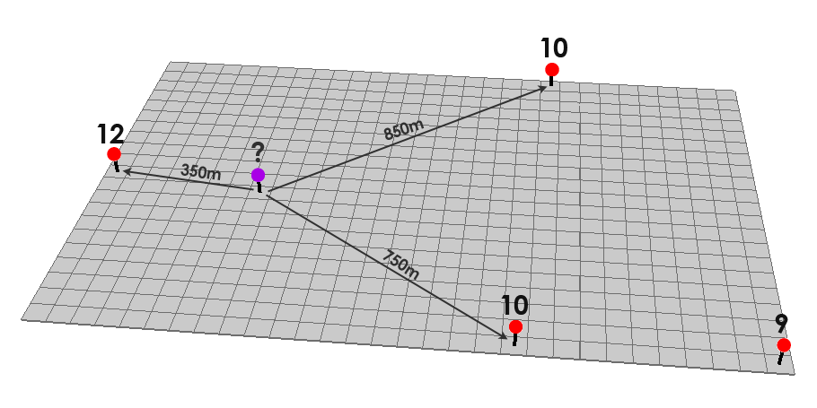
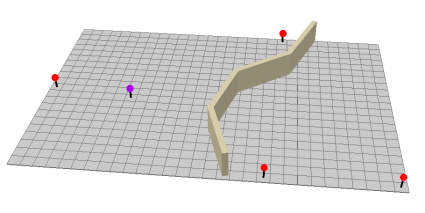
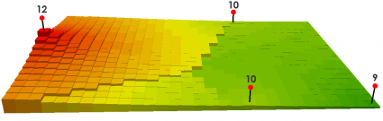
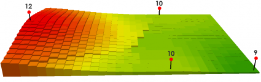
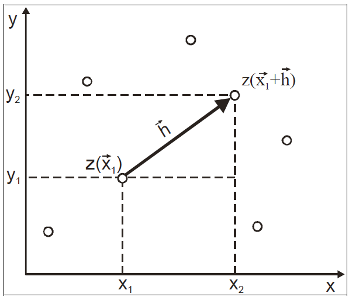
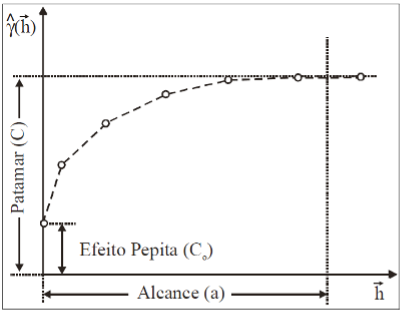
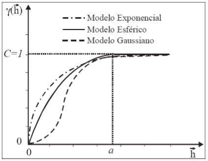
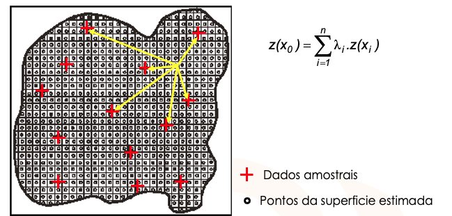

```{r}
library(appraiseR)
library(mosaic)
```


# Transformações não-lineares de v.a.

## Transformações não-lineares de v.a.

- Também podemos utilizar funções $h(X)$ não-lineares para transformar variáveis
aleatórias
  - Por exemplo: $Y = h(Z) = Z^2$
    - A variável $Y$ obtida com a elevação ao quadrado de uma var. com dist. 
    normal padrão tem distribuição dita $\chi^2_{(1)}$
      - $$f_Y(t) = \begin{cases}
      \frac{1}{\sqrt{2\pi t}} e^{-\frac{t}{2}} & \text { se } t> 0 \\
      0 & \text{ se } t \leq 0
      \end{cases}$$
  
- Uma medida da *dispersão* amostral, denominada *variância* é:
  - $$\mathbb V(X) = \frac{1}{n}\sum_{i = 1}^{n} (X_i - \mu)^2$${#eq-Variance}
    - É fácil notar que $Y = \mathbb V(X) \sim \chi^2_{(1)}$
    
## Distribuição $\chi^2_{(1)}$

```{r}
#| echo: true
#| label: fig-chiSquared
#| fig-cap: "Distribuição $\\chi^2$ com 1 grau de liberdade."
#| fig-height: 4
#| fig-width: 7
plotDist('chisq', params = list(df = 1), ylim = c(0, 1),
         main = expression("Distribuição" ~chi[(1)]^2),
         xlab = "t", ylab = expression(f[Y](t) == Z^2))
```

- $\mathbb E(Y) = 1$ (variância da distribuição normal padrão é igual a 1!)


## Transformações não-lineares

- Seja $Z$ uma variável com distribuição normal padrão
  - Seja $\mu$ e $\sigma>0$ dois números reais
    - Então $$X = e^{\mu + \sigma Z}$${#eq-TransfLognormal}
      - tem distribuição dita lognormal!

- Inversamente, se $X$ é uma variável com distribuição lognormal
  - Então $Y = \ln(X)$ 
    - É uma variável com distribuição normal!

- A distribuição lognormal tem *fdp*:
  - $$f_X(t) = \frac{1}{t\sigma\sqrt{2\pi}}\exp\left (-\frac{(\ln(t) - \mu)^2}{2\sigma^2} \right)$${#eq-Lognormal}
  
## Distribuição Lognormal

```{r}
#| echo: true
#| label: fig-Lognormal
#| fig-cap: "Distribuição Lognormal"
mosaic::plotDist("lnorm", params = list(meanlog = 0, sdlog = 0.25),
                 main = "Distribuição Lognormal",
                 xlab = "t", ylab = expression(f[Y](t) == e^{0.25*Z}))
```


```{r}
#| eval: false
library(EnvStats)
mosaic::plotDist("lnormAlt", params = list(mean = 1, cv = .25),
                 main = "Distribuição Lognormal")
```

## Distribuição Lognormal

```{r}
#| echo: true
#| label: fig-Lognormal2
#| fig-cap: "Distribuição Lognormal ($\\mu^* = 5000$)"
mosaic::plotDist("lnorm", params = list(meanlog = log(5000), sdlog = 0.25),
                 main = "Distribuição Lognormal",
                 xlab = "t", 
                 ylab = expression(f[Y](t) == e^{0.25*Z~+~plain(ln)~5000})
                 )
```

## Distribuição Lognormal

### Estimação de parâmetros

- Os parãmetros da distribuição lognormal podem ser assim estimados:
  - $$\hat \mu = \frac{1}{n} \sum_{i=1}^n \ln(X_i)$$
  - $$\hat \sigma^2 = \frac{1}{n} \sum_{i=1}^n (\ln(X_i)-\hat\mu)^2$$

# Aplicações

## Casas nos EUA

```{r}
#| echo: true
library(wooldridge)
data(hprice3)
head(hprice3, n = 10)
```


## Análise Exploratória

### Diagramas de Caixa

```{r}
#| echo: true
boxplot(hprice3$price, horizontal = T)
```

## Análise Exploratória


## Os cinco números de Tukey

- O famoso estatístico John Tukey, em sua obra clássica, *Exploratory Data
Analysis*, sugeriu os diagramas de caixa para ilustrar rapidamente os cinco
números que considerava sugestivos da amostra:
  - Valor Mínimo
  - Primeiro Quartil
  - Segundo Quartil ou Mediana
  - Terceiro Quartil
  - Valor Máximo
  
## O que são Quartis?

- Para uma variável aleatória $X = X_1, X_2, \ldots, X_n$, o k-ésimo quartil,
$Q_k$, é definido como o valor que separa a amostra em dois subconjuntos tal que
(Moors 1988, 25):
  - $$\mathbb P(X < Q_K) \leq k/4, \, \mathbb P(X > Q_K) \leq 1 - k/4, \, k = 1, 2, 3$$ 

- Também pode-se dizer, mas é menos comum, que $Q_0 = \min(X)$ e $Q_4 = \max(X)$

## O que são Percentis?

- Analogamente aos quartis, os percentis são:
  - $$\mathbb P(X < P_K) \leq k/100, \, \mathbb P(X > P_K) \leq 1 - k/100 \, k = 1, 2, \ldots, 99$$ 

- Também pode-se dizer que $P_0 = \min(X)$ e $P_{100} = \max(X)$

- Também é possível definir *Tercis*, *Quintis*, e assim por diante!
  - Tercis:
    - $$\mathbb P(X < T_K) \leq k/3, \, \mathbb P(X > T_K) \leq 1 - k/3, \, k = 1, 2$$
    
## Histograma

```{r}
hist(hprice3$price)
```

## Histograma

```{r}
hist(hprice3$land)
```

## Histograma

```{r}
hist(log(hprice3$price))
```

## Histograma

```{r}
hist(log(hprice3$land))
```

# Análises de Regressão

## Análise com preços totais

```{r}
#| echo: true
plot(price ~ area, data = hprice3)
```

## Análise com preços totais

```{r}
#| echo: true
plot(price ~ area, data = hprice3)
abline(lm(price ~ area, data = hprice3), col = "red", lty = 2)
```

- $R^2 = 0,41$

## Análise com preços unitários

```{r}
#| echo: true
hprice3 <- within(hprice3, PU <- price/area)
plot(PU ~ area, data = hprice3)
```

## Análise com preços unitários

```{r}
#| echo: true
plot(PU ~ area, data = hprice3)
abline(lm(PU ~ area, data = hprice3), col = "red", lty = 2)
```

- $R^2 = 0,015$

## Análise com preços unitários

```{r}
#| echo: true
hprice3 <- within(hprice3, {
  PU <- price/land
})
plot(PU ~ land, data = hprice3)
```

## Análise com preços unitários

```{r}
#| echo: true
plot(log(PU) ~ log(land), data = hprice3)
abline(lm(log(PU) ~ log(land), data = hprice3), col = "red", lty = 2)
```

## Estatísticas dos coeficientes

```{r}
fit <- lm(log(PU) ~ log(land), data = hprice3)
summary(fit)
```

- Com apenas uma variável, 70% de poder de explicação!

## Soma de efeitos

```{r}
fit1 <- update(fit, .~ . + log(area), data = hprice3)
summary(fit1)
```

- A segunda variável acrescenta 10 p.p. em poder de explicação!

## Soma de efeitos (2)

```{r}
fit2 <- update(fit1, .~. + age)
summary(fit2)
```

## Soma de efeitos (3)

```{r}
fit3 <- update(fit2, .~. + y81)
summary(fit3)
```

## Soma de efeitos (3)

```{r}
fit4 <- update(fit3, .~. + nbh)
summary(fit4)
```

## Modelo Final

- Para definição do modelo final, precisamos definir as características do
imóvel padrão
  - área do terreno (moda): `r brf(collapse::fmode(hprice3$land))` sq. ft. (1 acre $\approx$ 4.047 m2)
  - área construída (moda): `r brf(collapse::fmode(hprice3$area))` sq. ft. ($\approx$ 230 m2)
  - idade (convenção): 0 (novo)
  - year (convenção): 1978 (ano de venda)
  - nbh (convenção): 0
  
. . . 

```{r}
library(car)
FinalFit <- lm(log(PU) ~ log(land/43560) + log(area/2464) + age + y81 + nbh,
               data = hprice3)
S(FinalFit)
```

## Verificação dos resíduos do modelo

```{r}
library(ggResidpanel)
resid_panel(FinalFit, type = "standardized")
```

## Saneamento do modelo

```{r}
which(abs(rstandard(FinalFit)) > 3)
```


## Modelo Final saneado

```{r}
FinalFit <- update(FinalFit, subset = -c(46, 52, 67, 168, 230))
resid_panel(FinalFit, type = "standardized")
```

## Modelo Final saneado

```{r}
S(FinalFit)
```

 
## Equações de regressão e de estimação

- **Equação de regressão**:
  - $$
    \begin{align*}
    \ln (\text{PU}) &= 0,85 - 0,90\cdot \ln(\text{land}/43560) + \\
    &0,64 \cdot \ln(\text{area}/2464) - 0,004\cdot \text{age} + \\
    &0,35\cdot y81 - 0,023\cdot \text{nbh} + \varepsilon
    \end{align*}
    $$ {#eq-EqReg}

- **Equação de estimação**:
  - Para a equação de estimação, deve-se exponenciar a @eq-EqReg:
  - $$
    \begin{align*}
    \text{PU} &= \exp(0,85 - 0,90\cdot \ln(\text{land}/43560) + \\
    &0,64 \cdot \ln(\text{area}/2464) - 0,004\cdot \text{age} + \\
    &0,35\cdot y81 - 0,023\cdot \text{nbh} + \varepsilon)
    \end{align*}
    $$ {#eq-EqEst}
    
# Homogeneneização

## Homogeneização

- Após o ajuste do modelo de regressão, deve-se "homogeneizar" os dados.
  - A homogeneização consiste na transformação dos dados da amostra em imóveis
  paradigma
  - Ex.: um dado amostral com área de 500 $m^2$ apresenta $PU = 1.000,00$. Qual 
  seria o preço unitário observado deste dado se ele tivesse a mesma área do 
  imóvel paradigma, de 450 $m^2$?
    - $$F_A = \left ( \frac{500}{450} \right )^{-0,25}$$ {#eq-abunahman}
    - $F_A = 0,974$
    - $PU_{\text{Hom}} = \frac{1.000}{0,974} = 1.026,70$
    - O fator da @eq-abunahman é conhecido como fator área de Abunahman
    
- De onde vem o fator área???

## Derivação racional de fatores

- No final do processo de modelagem obtemos:
  - $$\widehat{\ln(PU)} = \hat \beta_0 + \hat \beta_1 X_1 + \ldots + \hat \beta_k X_k$$
  
- Então:
  - $$\widehat{PU} = \exp(\hat \beta_0 + \hat \beta_1 X_1 + \ldots + \hat \beta_k X_k)$$
  - $$\widehat{PU} = \exp(\hat \beta_0) \cdot  \exp(\hat \beta_1 X_1) \cdot \ldots \cdot \exp(\hat \beta_k X_k)$$
  
- Se o modelo estiver centralizado no lote paradigma:
  - $\widehat{PU_{\text{Hom}}} = \exp(\hat \beta_0)$
  - $F_{X_1} = \exp(\hat \beta_1 X_1) = \exp(\hat \beta_1)^{X_1}$
  - $\ldots$
  - $F_{X_k} = \exp(\hat \beta_k X_k) = \exp(\hat \beta_k)^{X_k}$
  
## Derivação racional de fatores
  
- Obs.: se $\hat \beta_k \ln(X_k)$ então:
  - $F_{X_k} = \exp[\hat \beta_k \ln(X_k)] = X_k^{\hat \beta_k}$
  
## Derivação racional de fatores

- Exemplo:

. . . 

```{r}
dados <- within(hprice3, PU <- price/land)
dados <- dados[, c("year", "y81", "price", "age", "nbh", "cbd", "area", "land", "dist", "PU")]
```

```{r}
#| echo: true
dados <- within(dados, {
  Fl <- (land/43560)^(-.90)
  Fa <- (area/2464)^(.64)
  Fage <- exp(-0.003)^age
  Fyear <- exp(.35)^y81
  PUHom <- PU/(Fl*Fa*Fage*Fyear)
})
```

```{r}
head(dados)
```

## Derivação racional de fatores

```{r}
#| echo: true
hist(dados$PU)
```

## Derivação racional de fatores

```{r}
#| echo: true
hist(dados$PUHom)
```

# Geração de superfícies de valores

## Geração de superfícies de valores

- A partir de uma amostra homogeneizada, pode-se gerar superfície de valores
unitários

- Estas superfícies podem ser geradas através de diversos métodos, *e.g*:
  - Krigagem
  - IDW
  
## Geração de superfícies de valores: IDW



## Geração de superfícies de valores: IDW


## Geração de superfícies de valores: IDW



## Geração de superfícies de valores: IDW

- Segundo @Embrapa2004 [p. 83], "uma alternativa simples para gerar uma
superfície bidimensional" consiste em ajustar uma função bidimensional sobre as
amostras, prevendo valores em uma grade ($\hat{z}_i$), com a seguinte formulação:

- $$
\hat{z}_{i} = \frac{\sum_{j = 1}^n w_{ij}z_j}{\sum_{j=1}^n w_{ij}}
$$ {#eq-IDW}

- Em que os pesos são computados segundo o inverso de uma potência $k$ das 
distâncias das amostras ao ponto de predição:

  - $$
w_{ij} = \frac{1}{d_{ij}^k}
$$ {#eq-IDW2}

- É um método extremamente simples e rápido para a obtenção de uma superfície de
valores.

## Geração de superfícies de valores: IDW




## Geração de superfícies de valores: IDW



## Geração de superfícies de valores: Krigagem

- A Krigagem, por outro lado, é uma "técnica de estimação e predição de 
superfície baseada na modelagem da estrutura de correlação espacial" 
[@Embrapa2004, 90].

- "... a diferença entre a krigagem e outros métodos de interpolação é a maneira
como os pesos são atribuídos às diferentes amostras. No caso de interpolação 
linear simples, por exemplo, os pesos são todos iguais a 1/N (N = número de 
amostras)";

- "na interpolação baseada no inverso do quadrado das distâncias, os pesos são 
definidos como o inverso do quadrado da distância que separa o valor interpolado
dos valores observados."

- "Na Krigeagem, o procedimento é semelhante ao de interpolação por média móvel 
ponderada, exceto que aqui os pesos são determinados a partir de uma análise 
espacial, baseada no semivariograma experimental. Além disso, a krigagem fornece,
em média, estimativas não tendenciosas e com variância mínima.”

## Geração de superfícies de valores: Krigagem



- @Embrapa2004 [p. 94]:
  - $$\gamma(h) = \frac{1}{2\mathcal N (\mathbf{h})} \sum_{i=1}^{\mathcal N(\mathbf{h})} [z(\mathbf{u_i}) - z(\mathbf{u_i} + \mathbf{h})]^2$$ {#eq-semivariograma}

## Geração de superfícies de valores: Krigagem



## Geração de superfícies de valores: Krigagem



## Geração de superfícies de valores: Krigagem

- $$\hat Z_{\mathbf{u_0}} = \sum_{i=1}^n \lambda_i \cdot Z(\mathbf u_i)$$
  - Com $\lambda_i$ definidos através do sistema de krigagem ordinária [@Embrapa2004, 104]:
  - $$
  \left\{\begin{matrix}
  \sum_{j=1}^n \lambda_j C(\mathbf{u_i}, \mathbf{u_j}) - \alpha =   C(\mathbf{u_i}, \mathbf{u_0}) &  \text{para}\, i = 1, \ldots, n\\
  \sum_{j=1}^n \lambda_j= 1&  \\
  \end{matrix}\right. 
  $$

## Geração de superfícies de valores: Krigagem



# Referências
  